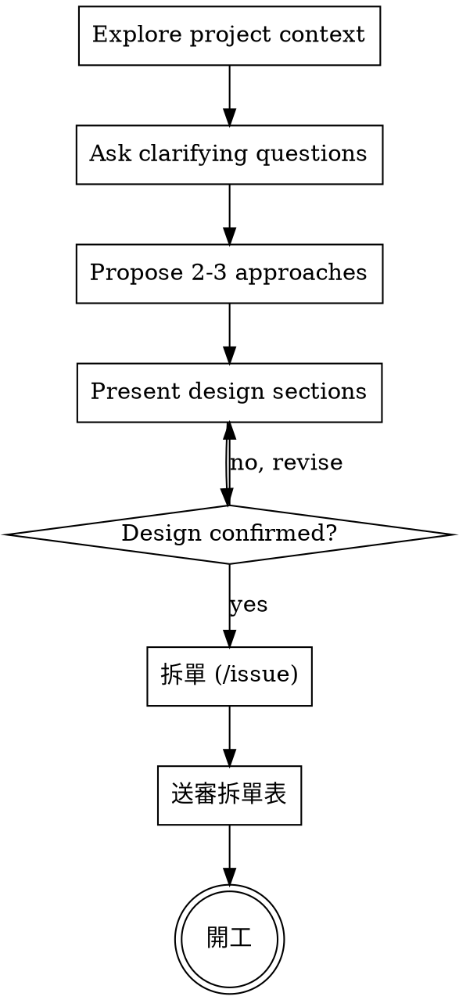

> **來源**:改編自 [superpowers](https://github.com/obra/superpowers) by Jesse Vincent(MIT License,見 `../LICENSE-superpowers`)。
> 本副本已針對本工作流客製,與上游不再同步。

# Brainstorming Ideas Into Designs

透過對話把想法收斂成可施工的設計。先摸清專案脈絡,再一次問一個問題細化想法;想清楚了就把設計講給使用者確認,然後**拆單開工**。

## 觸發條件

**需求模糊、方向未定**才進本 skill——使用者說不清要什麼、或同一句話有多種實質不同的解讀。

**這些直接做,不進本 skill**:需求明確的新功能(「新」不是觸發條件)、既有行為的修改、單檔小修、config 調整、照既有 pattern 加東西。目標明確的工作跑完整套訪談只會產出無人閱讀的文件並延後交付。

判準是**歧義**,不是規模也不是新舊:不同解讀會不會導致實質不同的工作?會就訪談,不會就開工。

<HARD-GATE>
設計方向未經使用者確認前,不寫實作程式碼。確認的形式是**對話中的一句「對」**——不是書面文件核准。
</HARD-GATE>

## Checklist

You MUST create a task for each of these items and complete them in order:

1. **Explore project context** — check files, docs, recent commits
2. **Offer the visual companion just-in-time** — NOT upfront. The first time a question would genuinely be clearer shown than described, offer it then (its own message); on approval its browser tab opens for you. If no visual question ever arises, never offer it. See the Visual Companion section below.
3. **Ask clarifying questions** — one at a time, understand purpose/constraints/success criteria
4. **Propose 2-3 approaches** — with trade-offs and your recommendation
5. **Present design** — in sections scaled to their complexity, get user confirmation after each section
6. **拆單** — 照 `/issue` 開成依賴鏈,規範性內容(驗收條件、規格值)逐張抄進 issue body
7. **送審拆單表** — 每張列:標題／依賴／AFK 或 HITL。使用者點頭後**直接開工**,推到 DELIVERED

## Process Flow



**終點是開工,不是交出一份待核准的文件。** 唯一送審對象是拆單表。

## The Process

**Understanding the idea:**

- Check out the current project state first (files, docs, recent commits)
- Before asking detailed questions, assess scope: if the request describes multiple independent subsystems (e.g., "build a platform with chat, file storage, billing, and analytics"), flag this immediately. Don't spend questions refining details of a project that needs to be decomposed first.
- If the project is too large for a single design pass, help the user decompose into sub-projects: what are the independent pieces, how do they relate, what order should they be built? 太大到連拆單都拆不動時走 `/wayfinder` 開決策票地圖。
- For appropriately-scoped projects, ask questions one at a time to refine the idea
- Prefer multiple choice questions when possible, but open-ended is fine too
- Only one question per message - if a topic needs more exploration, break it into multiple questions
- Focus on understanding: purpose, constraints, success criteria

**Exploring approaches:**

- Propose 2-3 different approaches with trade-offs
- Present options conversationally with your recommendation and reasoning
- Lead with your recommended option and explain why
- YAGNI ruthlessly - remove unnecessary features from every approach and design

**Presenting the design:**

- Once you believe you understand what you're building, present the design
- Scale each section to its complexity: a few sentences if straightforward, up to 200-300 words if nuanced
- Ask after each section whether it looks right so far
- Cover: architecture, components, data flow, error handling, testing
- Be ready to go back and clarify if something doesn't make sense

**Design for isolation and clarity:**

- Break the system into smaller units that each have one clear purpose, communicate through well-defined interfaces, and can be understood and tested independently
- For each unit, you should be able to answer: what does it do, how do you use it, and what does it depend on?
- Can someone understand what a unit does without reading its internals? Can you change the internals without breaking consumers? If not, the boundaries need work.
- Smaller, well-bounded units are also easier for you to work with - you reason better about code you can hold in context at once, and your edits are more reliable when files are focused. When a file grows large, that's often a signal that it's doing too much.

**Working in existing codebases:**

- Explore the current structure before proposing changes. Follow existing patterns.
- Where existing code has problems that affect the work (e.g., a file that's grown too large, unclear boundaries, tangled responsibilities), include targeted improvements as part of the design - the way a good developer improves code they're working in.
- Don't propose unrelated refactoring. Stay focused on what serves the current goal.

## 拆單

設計確認後的動作是拆單,不是寫文件。照 `/issue` 的規矩開成依賴鏈:

- 驗收條件、規格值等規範性內容**逐張抄進 issue body**——實作與 VERIFY 只認 issue,「細節在對話裡」等於不存在
- 每張標清楚依賴,以及 AFK(agent 可自跑)或 HITL(需人介入)
- 把拆單表給使用者過目,點頭後直接開工

## Spec 檔(選配,兩種情況才寫)

預設不產出 spec。只有這兩種情況值得寫:

1. **取捨有多個合理方案**,需要留否決案供日後考古
2. **跨多波、決策成串**(這種先走 `/wayfinder`)

寫了也**照樣直接拆單開工,不送核准**——spec 是決策帳,不是施工藍本,也不是交付物。位置 `docs/superpowers/specs/YYYY-MM-DD-<topic>-design.md`,寫完 commit 即凍結,進度歸 issue。

**Machine-readable spec header (required):**

```yaml
---
spec_id: <kebab-slug,與檔名 topic 一致>
created: YYYY-MM-DD
rtm_refs: []             # RTM 引用;無 RTM 專案留空
stories:
  - id: S1
    as: <角色>
    want: <一句話能力描述>
    acceptance:          # 可驗證的完成條件——之後直接抄進 issue body
      - "<具體、可執行、可判 pass/fail 的條件>"
    not_in_scope: []     # 明確排除項,防 scope creep
decisions:               # 過程確認的設計決策與被否決的替代案(這是 spec 的主要價值)
  - question: <決策點>
    choice: <選擇>
    reason: <理由>
touches:
  - path: <檔案路徑>
    action: modify       # create|modify
clarifications: []       # 未決事項;非空 = 先問使用者,不要猜著往下做
---
```

Frontmatter rules:

- Every design decision the user confirmed goes into `decisions` — 口頭共識不落 frontmatter 等於沒發生
- `acceptance` entries must be checkable (「搜尋 '王' 回傳姓名含王的結果」),不是行為重述(「搜尋功能正常」)
- `clarifications` is the explicit ambiguity ledger: anything unresolved goes here instead of being silently guessed — resolve with the user before 拆單
- The body must not contradict the frontmatter; the frontmatter is a faithful summary, not a separate document

寫完掃一次:placeholder／TBD／TODO 清空、章節之間不互相矛盾、每個 `acceptance` 都可判 pass/fail。就地修完往下走,不用再 review 一輪,也不用請使用者核准。

## Visual Companion

A browser-based companion for showing mockups, diagrams, and visual options during brainstorming. Available as a tool — not a mode. Accepting the companion means it's available for questions that benefit from visual treatment; it does NOT mean every question goes through the browser.

**Offering the companion (just-in-time):** Do NOT offer it upfront. Wait until a question would genuinely be clearer shown than told — a real mockup / layout / diagram question, not merely a UI *topic*. The first time that happens, offer it then, as its own message:
> "This next part might be easier if I show you — I can put together mockups, diagrams, and comparisons in a browser tab as we go. It's still new and can be token-intensive. Want me to? I'll open it for you."

**This offer MUST be its own message.** Only the offer — no clarifying question, summary, or other content. Wait for the user's response. If they accept, start the server with `--open` so their browser opens to the first screen automatically. If they decline, continue text-only and don't offer again unless they raise it.

**Per-question decision:** Even after the user accepts, decide FOR EACH QUESTION whether to use the browser or the terminal. The test: **would the user understand this better by seeing it than reading it?**

- **Use the browser** for content that IS visual — mockups, wireframes, layout comparisons, architecture diagrams, side-by-side visual designs
- **Use the terminal** for content that is text — requirements questions, conceptual choices, tradeoff lists, A/B/C/D text options, scope decisions

A question about a UI topic is not automatically a visual question. "What does personality mean in this context?" is a conceptual question — use the terminal. "Which wizard layout works better?" is a visual question — use the browser.

If they agree to the companion, read the detailed guide before proceeding:
`skills/brainstorming/visual-companion.md`
